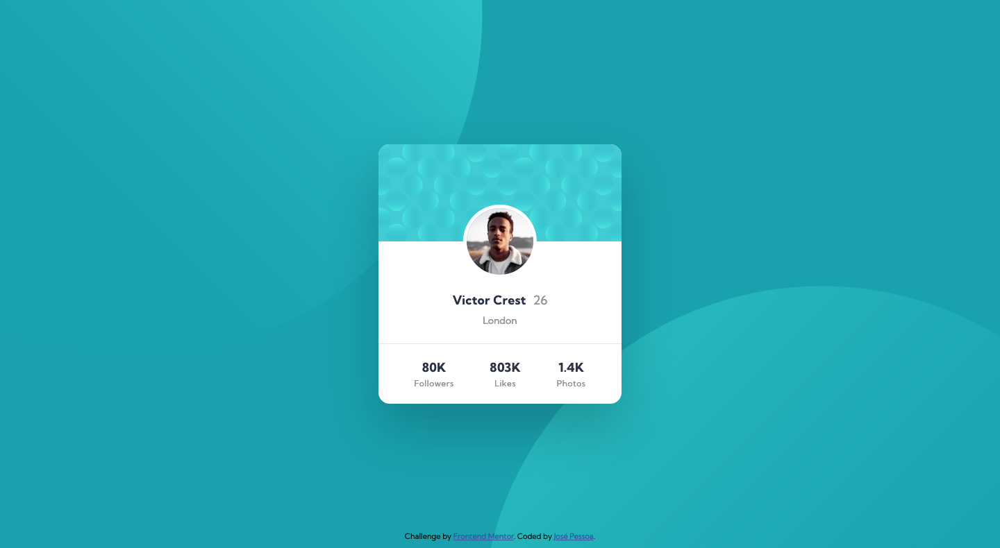
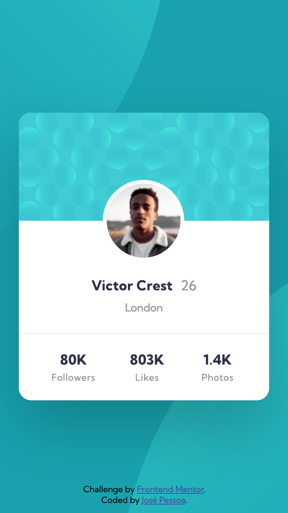

# Frontend Mentor - Profile card component solution

## Welcome! 👋

This is a solution to the [Profile card component challenge on Frontend Mentor](https://www.frontendmentor.io/challenges/profile-card-component-cfArpWshJ). Frontend Mentor challenges help you improve your coding skills by building realistic projects.

## Table of contents

- [Overview](#overview)
  - [The challenge](#the-challenge)
  - [Screenshots](#screenshots)
  - [Links](#links)
- [My process](#my-process)
  - [Built with](#built-with)
- [Author](#author)

## Overview

### The challenge

Users should be able to:

- Build out the project to the designs provided

### Screenshots

Desktop

Mobile

### Links

- Solution URL: [Solution Page](https://www.frontendmentor.io/solutions/profile-card-component-using-html-and-css-flexbox-VdSj9kJXj)
- Live Site URL: [Preview Site](https://jgbpessoa.github.io/profile-card/)

## My process

### Built with

- Semantic HTML5 markup
- CSS custom properties
- Mobile-first workflow
- Flexbox

## Author

Coded by José Pessoa 🧪 💻

- Frontend Mentor - [@jgbpessoa](https://www.frontendmentor.io/profile/jgbpessoa)
